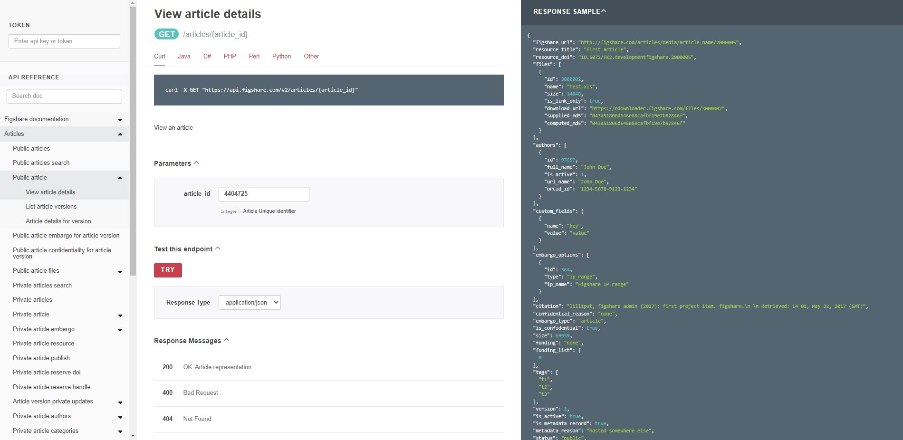
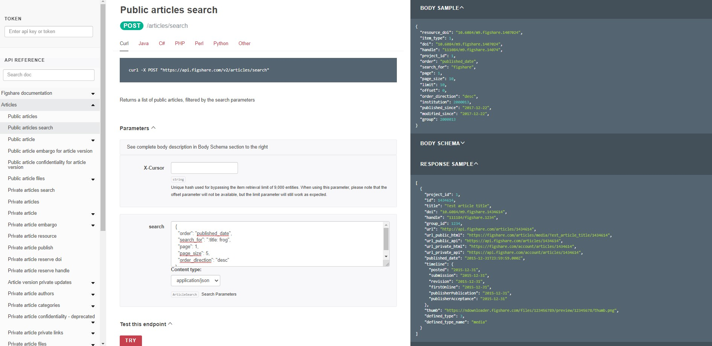

# Understanding the API Documentation

## Where is the documentation?

The Figshare API is documented at [https://docs.figshare.com](https://docs.figshare.com). If you are an administrator at an institution, you have access to a stage version of the API as well.

## How to read the documentation

There are three panes on the documentation site
1. Left side: Table of Contents with links to the endpoints and documentation sections
2. Middle: Endpoint details including the endpoint syntax, a short description, error information, and some endpoints can be called directly in this pane
3. Right side: Input and Output examples.
 - If the endpoint accepts data you will see a "Body Sample" and a "Body Schema"
 - If the endpoint provides data you will see a "Response Sample" and a "Response Schema"


## Interacting with the API user interface 

Here are several exercises to become familiar with the API endpoints and the formatting required to use them

### Retrieve the full metadata for an item

For this example, we will use a presentation titled "Using APIs to customise repositories and engage audiences". You can see the file and metadata by visiting this DOI: [https://doi.org/10.6084/m9.figshare.5616445.v2](https://doi.org/10.6084/m9.figshare.5616445.v2). Notice the DOI takes you to this URL:
https://figshare.com/articles/presentation/Using_APIs_to_customise_repositories_and_engage_audiences/5616445

While you can download the citation metadata directly from the user interface, to download all of the metadata you need to use the API. Visit this URL: [https://docs.figshare.com/#article_details](https://docs.figshare.com/#article_details). In the article_id field enter the number that is at the very end of the URL above: 5616445. Then click the red 'TRY' button. A pop up should appear with all the metadata.

You can view this same output in its own browser tab by visiting the API endpoint with the item id appended to it: [https://api.figshare.com/v2/articles/5616445](https://api.figshare.com/v2/articles/5616445)



### Perform a metadata search

Figshare search will search all metadata fields by default. You can limit to date ranges and order the results in several ways. You can also search within specific metadata fields. In this example, we will search for records that contain the term "frog" in the title and will return 5 results in descending order by published date. Enter the following JSON into the parameters 'search' box at this endpoint: [https://docs.figshare.com/#articles_search](https://docs.figshare.com/#articles_search)

```
{
  "order": "published_date",
  "search_for": ":title: frog",
  "page": 1,
  "page_size": 5,
  "order_direction": "desc"
}
```



### Download a file

There are several ways to download files through the API. Each file that is part of a record has it's own download URL. You can find this URL in the full metadata retrieved above or you can enter the item id at this endpoint: [https://docs.figshare.com/#article_files](https://docs.figshare.com/#article_files). For item 4404725 the download URL for the file is https://ndownloader.figshare.com/files/7131113. Visiting that URL will automatically start the download (*Note: the file is 20MB so visit that URL only if you want to download the file!*).

You can also start the download through a dedicated endpoint and all you need is the file id using one of the methods described above. Enter the file id at this endpoint and the download will begin: https://docs.figshare.com/#file_download. Try that with the file from this item (219KB): [https://doi.org/10.6084/m9.figshare.5616409.v3](https://doi.org/10.6084/m9.figshare.5616409.v3)

### Authenticate and retrieve metadata from your account

To retrieve or send information that is not public, you will need to [create a token from your account](https://help.figshare.com/article/how-to-get-a-personal-token) and paste that into the API user interface. Once you've done that, visit this endpoint: [https://docs.figshare.com/#private_articles_list](https://docs.figshare.com/#private_articles_list). Paste the token into the upper left field in the API user interface and hit the 'TRY' button. You should see the basic metadata for the private and public items in your account.


### Administrators: See groups you administer
If you create a token from an administrator account, you will be able to use the endpoints under the 'Institutions' heading in the API user interface. After pasting your token in the upper left field, click on the 'Institutions' heading in the left pane and click on 'Private account institution groups'. Click the 'TRY' button and you'll see information for the groups your account is an administrator for.


