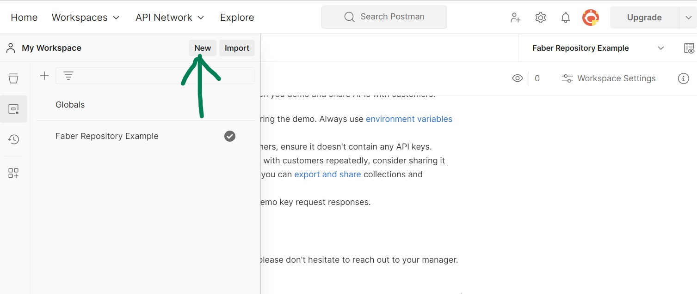
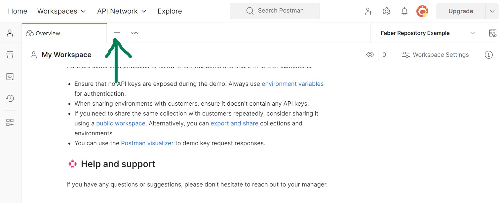
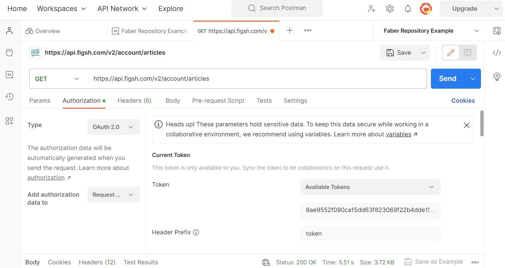
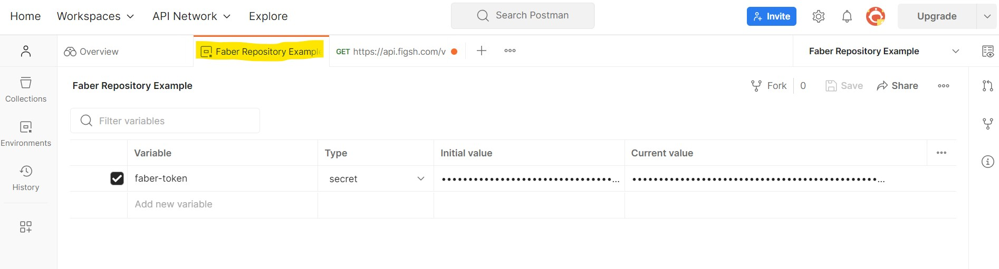
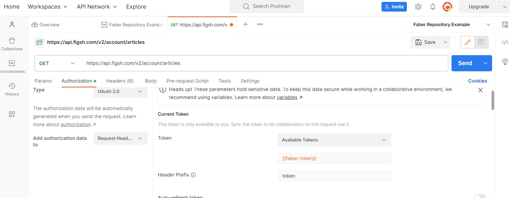

# Getting started with Postman

First set up an environment

Then add a request

You can add a token under 'Authorization'

Even better, save your token as a variable...

Then use that token under Authorization by putting double curly brackets around the variable name ({{variable name}}).

Change the request from Get to POST or PUT to match what the API endpoint. You can add information to the body area. This example uses POST with this endpoint: https://docs.figsh.com/#private_article_create
The body contains JSON formatted metadata and the endpoint returns the item id as the 'entity_id' and the api URL for the item as 'location'

![postman example image - POST metadata to create item(../assets/postman-POST-send-body.jpg)