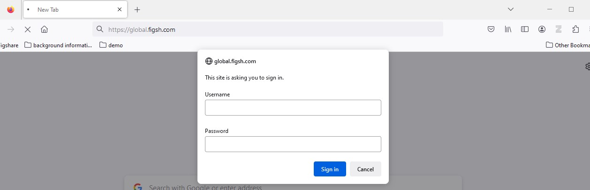
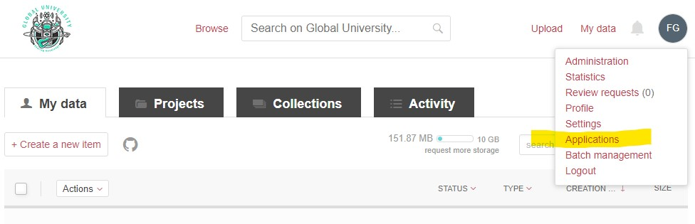
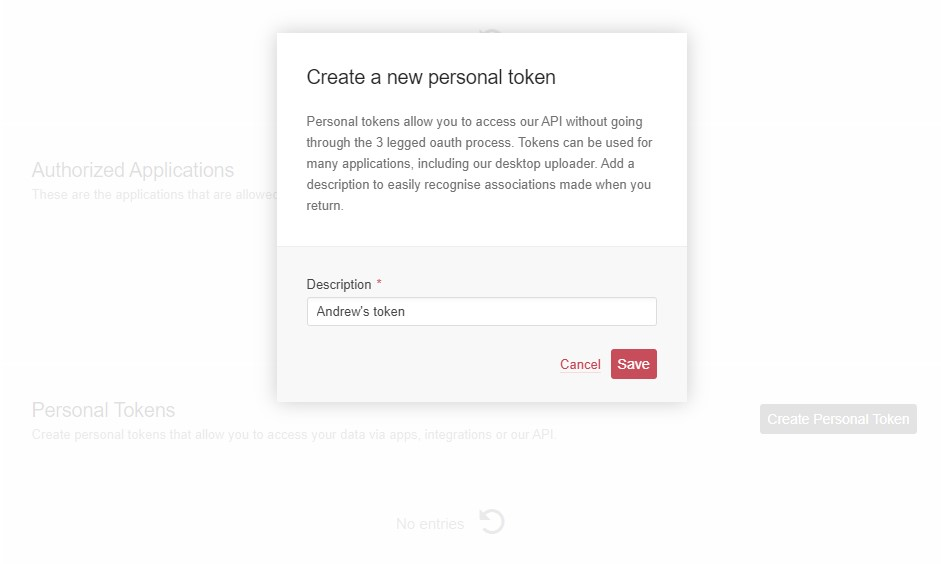

# Sandbox Instructions

## Overview

Figshare has a production environment which is what anyone with an internet connection can access, and a stage environment that is only available to institutional administrators. Both Production and Stage have their own API endpoints.

To access the API documentation for the stage environment, go to <a href="https://docs.figsh.com" target="_blank">https://docs.figsh.com</a>. For endpoints that require authentication, you will need a token from an account in the stage environment. 

So, if you are at an institution that uses Figshare, you may be able to access your account in the stage environment and use that. If not, you can use the sandbox repository we've set up for this workshop.

## Sandbox for the workshop
For this workshop, we've created a sandbox repository in the stage environment for participants to use. During the workshop we will provide the credentials to access this sandbox and an account.

### Logging in and creating a token
Point your browser to <a href="https://global.figsh.com" target="_blank">https://global.figsh.com</a>. Enter the first set of credentials (you may need to do this twice).

Click the red 'Log in' text at the top right and login using the account credentials we provide you. Others may be using the same account. 

### Create a token
Click the profile icon at the top right and select Applications from the dropdown menu.

 Scroll to the bottom of the Applications screen and click the 'Create Personal Toekn' button. Put your name for the description- we will delete all these tokens after the workshop. Then copy the resulting string to a text document on your computer. 
 
 

