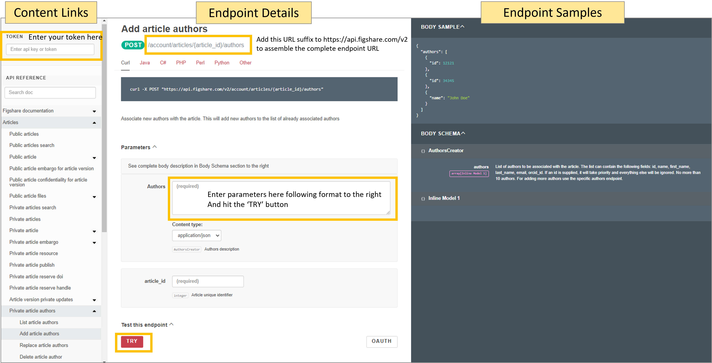
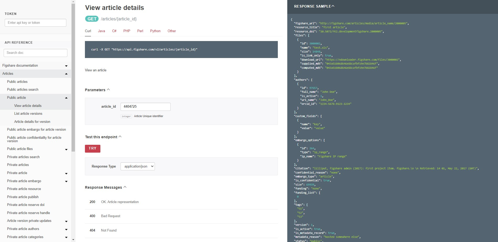
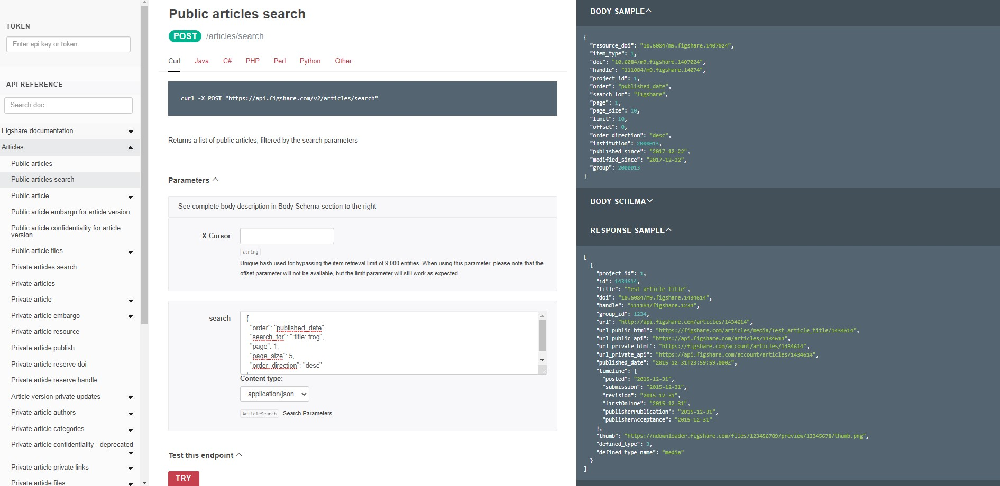
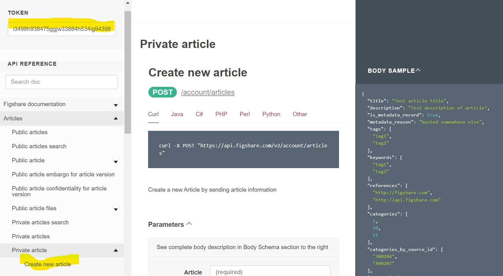
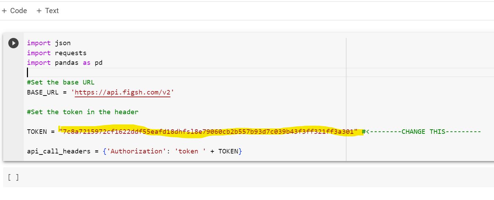

# Figshare API Workshop - Figshare Elements User Day

Here are instructions on how to use your institution's stage repository and the workshop [sandbox repository](./sandbox-instructions.html).

Table of contents:
- [Figshare API brief overview](#the-figshare-api)
- [Using the API without scripting](#using-the-apis-without-scripting)
- [Using scripts to access the API](#using-scripts-to-access-the-api)
- [Chain api requests to retrieve information](#chain-api-requests-to-retrieve-information)
- [Example metadata workflows](#example-metadata-workflows)
- [Other resources](#other-resources)
 

# The Figshare API
The Figshare API has evolved over time and there are actually 4 different APIs:
- REST API: https://api.figshare.com/v2
- Stats API: https://stats.figshare.com/ 
- OAI-PMH: https://api.figshare.com/v2/oai 
- ResourceSync: example: https://scholardata.sun.ac.za/.well-known/resourcesync

This workshop will focus on using the REST and Stats APIs.

# Using the APIs without scripting

## How to use the documentation

We'll be using the stage API <a href="https://docs.figsh.com" target="_blank">documentation site</a>

There are three panes on the page:
1. Left side: Table of Contents with links to the endpoints and documentation sections
2. Middle: Endpoint details including the endpoint syntax, a short description, error information, and some endpoints can be called directly in this pane
3. Right side: Input and Output examples.
 - If the endpoint accepts data you will see a "Body Sample" and a "Body Schema"
 - If the endpoint provides data you will see a "Response Sample" and a "Response Schema"


<br>
> ### Try it out 1 - retrieve metadata
> Retrieve all the metadata for this item: "Using APIs to customise repositories and engage audiences" available here: <a href="https://doi.org/10.6084/m9.figshare.5616445.v2" target="_blank">https://doi.org/10.6084/m9.figshare.5616445.v2</a>. Notice the DOI takes you to this URL:
<a href="https://figshare.com/articles/presentation/Using_APIs_to_customise_repositories_and_engage_audiences/5616445" target="_blank">https://figshare.com/articles/presentation/Using_APIs_to_customise_repositories_and_engage_audiences/5616445</a>

> Visit this URL: <a href="https://docs.figshare.com/#article_details" target="_blank">https://docs.figshare.com/#article_details</a> and in the article_id field enter the number that is at the very end of the URL above: 5616445. Then click the red 'TRY' button. A pop up should appear with all the metadata.

> You can view this same output in its own browser tab by visiting the API endpoint with the item id appended to it: <a href="https://api.figshare.com/v2/articles/5616445" target="_blank">https://api.figshare.com/v2/articles/5616445</a>

> 
<br>
> ### Try it out 2 - retrieve views

> To retrieve views, you will use a <a href="https://docs.figshare.com/#stats" target="_blank">stats endpoint</a>. The documentation site does not provide an interface to add parameters, but you can construct the URL yourself. Try retrieving the views for the item used above by pasting this URL into a browser tab:

> ```
https://stats.figshare.com/total/views/article/5616445
> ```
<br>
> ### Try it out 3 - perform a metadata search

>Figshare search will search all metadata fields by default. You can limit to date ranges and order the results in several ways. You can also search within specific metadata fields. In this example, we will search for records that contain the term "frog" in the title and will return 5 results in descending order by published date. Enter the following JSON into the parameters 'search' box at this endpoint: [https://docs.figshare.com/#articles_search](https://docs.figshare.com/#articles_search)

>```
{
  "order": "published_date",
  "search_for": ":title: frog",
  "page": 1,
  "page_size": 5,
  "order_direction": "desc"
}
>```

>
<br>
You can retrieve information in this way for items, Projects, and Collections.


## API authentication
- REST API - account token: https://help.figshare.com/article/how-to-get-a-personal-token
- Stats API - Views/downloads/shares for items/collections/projects no authentication needed. Within institution scope, separate username/password required, contact support@figshare.com to get credentials for your institution.

Credentials are sent to the API server via the Authorization header. **Make sure credentials are stored in a secure location!**


> ### Try it out 4 - authenticate and send metadata to create a new item
> 
> 1. Create a token for your personal account or the sandbox account ([sandbox instructions](./sandbox-instructions.html)).
> 2. Navigate to the documentation site (here for personal accounts or here for sandbox accounts) and paste your token in the upper left field.
> 3. On the left panel, click 'Articles' and then click 'Private article', then 'Create new article'. This endpoint accepts JSON formatted metadata and creates a draft article in the account linked to the token you used.
> 4. Copy the JSON below and paste it into the Parameters box (replace 'YOUR NAME' with your name). Click the red 'Try' button.
> 5. Look in your account to see the item. You can delete the draft as well.
> ```
{
  "title": "YOUR NAME made this using the API"
}
> ```

> 
<br>

# Using scripts to access the API

The following examples illustrate how you can retrieve, send, and update information through the API. You can paste the code into a <a href="https://colab.research.google.com/?utm_source=scs-index" target="_blank">Google Colab document</a> (requires Google account) to try them out. The <a href="https://docs.figshare.com" target="_blank">documentation site</a> has more details on all endpoints and includes information on GET, POST, PUT, and DELETE methods.

- [Return results](#return-results-get)
- [Authenticate](#authenticate-get-post-put-delete)
- [Send data](#send-data-post-put)


### Return results (GET)

Any public metadata or files can be retrieved through the API without authentication. In the example below, the full metadata record for an item is retrieved. The ITEM_ID is the number at the end of any item's URL.

Python:
```py
import json
import requests
#Set the base URL and ITEM_ID
BASE_URL = 'https://api.figshare.com/v2' 
ITEM_ID = 123456
#Retrieve public metadata from the endpoint
s=requests.get(BASE_URL + '/articles/' + str(ITEM_ID))
#Load the metadata as JSON
metadata=json.loads(s.text)
#View the metadata
print(json.dumps(metadata, indent=2))
```

Output:
```
{
  "files": [
    {
      "id": 3074543,
      "name": "2011-02-15_14-24-56-228.png",
      "size": 470683,
      "is_link_only": false,
      "download_url": "https://ndownloader.figshare.com/files/3074543",
      "supplied_md5": "eb5c9c6b278b533f98aa02feae57c266",
      "computed_md5": "eb5c9c6b278b533f98aa02feae57c266"
    }
  ],
  "custom_fields": [],
  "authors": [
    {
      "id": 155524,
      "full_name": "Yunyan Deng",
      "is_active": false,
      "url_name": "_",
      "orcid_id": ""
    },
    {
      "id": 155526,
      "full_name": "Jianting Yao",
      "is_active": false,
      "url_name": "_",
      "orcid_id": ""
    },
    {
      "id": 155529,
      "full_name": "Xiuliang Wang",
      "is_active": false,
      "url_name": "_",
      "orcid_id": ""
    },
    {
      "id": 110581,
      "full_name": "Hui Guo",
      "is_active": false,
      "url_name": "_",
      "orcid_id": ""
    },
    {
      "id": 155532,
      "full_name": "Delin Duan",
      "is_active": false,
      "url_name": "_",
      "orcid_id": ""
    }
  ],
  "figshare_url": "https://plos.figshare.com/articles/dataset/Transcriptome_Sequencing_and_Comparative_Analysis_of_Saccharina_japonica_Laminariales_Phaeophyceae_under_Blue_Light_Induction/123456",
  "description": "<div><h3>Background</h3><p>Light has significant effect on the growth and development of <em>Saccharina japonica</em>, but there are limited reports on blue light mediated physiological responses and molecular mechanism. In this study, high-throughput paired-end RNA-sequencing (RNA-Seq) technology was applied to transcriptomes of <em>S. japonica</em> exposed to blue light and darkness, respectively. Comparative analysis of gene expression was designed to correlate the effect of blue light and physiological mechanisms on the molecular level.</p> <h3>Principal Findings</h3><p>RNA-seq analysis yielded 70,497 non-redundant unigenes with an average length of 538 bp. 28,358 (40.2%) functional transcripts encoding regions were identified. Annotation through Swissprot, Nr, GO, KEGG, and COG databases showed 25,924 unigenes compared well (E-value <10<sup>\u22125</sup>) with known gene sequences, and 43 unigenes were putative BL photoreceptor. 10,440 unigenes were classified into Gene Ontology, and 8,476 unigenes were involved in 114 known pathways. Based on RPKM values, 11,660 (16.5%) differentially expressed unigenes were detected between blue light and dark exposed treatments, including 7,808 upregulated and 3,852 downregulated unigenes, suggesting <em>S. japonica</em> had undergone extensive transcriptome re-orchestration during BL exposure. The BL-specific responsive genes were indentified to function in processes of circadian rhythm, flavonoid biosynthesis, photoreactivation and photomorphogenesis.</p> <h3>Significance</h3><p>Transcriptome profiling of <em>S. japonica</em> provides clues to potential genes identification and future functional genomics study. The global survey of expression changes under blue light will enhance our understanding of molecular mechanisms underlying blue light induced responses in lower plants as well as facilitate future blue light photoreceptor identification and specific responsive pathways analysis.</p> </div>",
  "funding": null,
  "funding_list": [],
  "version": 1,
  "status": "public",
  "size": 470683,
  "created_date": "2012-06-27T00:57:36Z",
  "modified_date": "2016-01-19T09:09:40Z",
  "is_public": true,
  "is_confidential": false,
  "is_metadata_record": false,
  "confidential_reason": "",
  "metadata_reason": "",
  "license": {
    "value": 1,
    "name": "CC BY 4.0",
    "url": "https://creativecommons.org/licenses/by/4.0/"
  },
  "tags": [
    "transcriptome",
    "sequencing",
    "comparative",
    "induction"
  ],
  "categories": [
    {
      "id": 69,
      "title": "Inorganic Chemistry",
      "parent_id": 38,
      "path": "",
      "source_id": "",
      "taxonomy_id": 10
    },
    {
      "id": 13,
      "title": "Genetics",
      "parent_id": 48,
      "path": "",
      "source_id": "",
      "taxonomy_id": 10
    },
    {
      "id": 61,
      "title": "Developmental Biology",
      "parent_id": 48,
      "path": "",
      "source_id": "",
      "taxonomy_id": 10
    }
  ],
  "references": [],
  "has_linked_file": false,
  "citation": "Deng, Yunyan; Yao, Jianting; Wang, Xiuliang; Guo, Hui; Duan, Delin (2016): Transcriptome Sequencing and Comparative Analysis of <em>Saccharina japonica</em> (Laminariales, Phaeophyceae) under Blue Light Induction. PLOS ONE. Dataset. https://doi.org/10.1371/journal.pone.0039704",
  "is_embargoed": false,
  "embargo_date": null,
  "embargo_type": null,
  "embargo_title": "",
  "embargo_reason": "",
  "embargo_options": [],
  "id": 123456,
  "title": "Transcriptome Sequencing and Comparative Analysis of <em>Saccharina japonica</em> (Laminariales, Phaeophyceae) under Blue Light Induction",
  "doi": "10.1371/journal.pone.0039704",
  "handle": "",
  "url": "https://api.figshare.com/v2/articles/123456",
  "published_date": "2012-06-27T00:57:36Z",
  "thumb": "https://s3-eu-west-1.amazonaws.com/ppreviews-plos-725668748/3074543/thumb.png",
  "defined_type": 3,
  "defined_type_name": "dataset",
  "group_id": 107,
  "url_private_api": "https://api.figshare.com/v2/account/articles/123456",
  "url_public_api": "https://api.figshare.com/v2/articles/123456",
  "url_private_html": "https://figshare.com/account/articles/123456",
  "url_public_html": "https://plos.figshare.com/articles/dataset/Transcriptome_Sequencing_and_Comparative_Analysis_of_Saccharina_japonica_Laminariales_Phaeophyceae_under_Blue_Light_Induction/123456",
  "timeline": {
    "posted": "2012-06-27T00:57:36",
    "firstOnline": "2016-01-19T09:09:40"
  },
  "resource_title": "Transcriptome Sequencing and Comparative Analysis of <em>Saccharina japonica</em> (Laminariales, Phaeophyceae) under Blue Light Induction",
  "resource_doi": "10.1371/journal.pone.0039704"
}
```


### Authenticate (GET, POST, PUT, DELETE)

Authentication is required for any endpoint that retrieves or accepts private or institutional information. A token can be <a href="https://help.figshare.com/article/how-to-get-a-personal-token" target="_blank">created for any user account</a> and provides access in line with the account's privileges.

In your Google Colab notebook add your token to the following code, paste into a cell in the notebook and run it. The examples in this section will use these credentials.

Paste this into a cell and add your token:
```py
import json
import requests
import pandas as pd 

#Set the base URL
BASE_URL = 'https://api.figsh.com/v2'

#Set the token in the header

TOKEN = "ENTER TOKEN HERE BETWEEN QUOTES" #<--------CHANGE THIS---------

api_call_headers = {'Authorization': 'token ' + TOKEN}

```

Here is what your Colab notebook might look like:



In the example below, a user retrieves 10 basic metadata records from their personal account. These records may include both public and private (draft) records. Note that the results are limited to 10 by using the page and page_size parameters. 

Python:
```py
#Libraries should already be imported, Base URL created, and authentication header created.

#Retrieve basic metadata for 10 items your account owns
r=requests.get(BASE_URL + '/account/articles?page=1&page_size=10', headers=api_call_headers)
#Load the metadata as JSON
metadata=json.loads(r.text)
#View the metadata for the first record
metadata[0]
```

Example Output:
```

  {
    "id": 8365555,
    "title": "Testing-full embargo-restrict access-unpublish-republish",
    "doi": "10.0166/FK2.stagefigshareare.8365555",
    "handle": "",
    "url": "https://api.figshare.com/v2/account/articles/8365555",
    "published_date": "2023-04-06T13:13:41Z",
    "thumb": "",
    "defined_type": 3,
    "defined_type_name": "dataset",
    "group_id": 9991,
    "url_private_api": "https://api.figshare.com/v2/account/articles/8365555",
    "url_public_api": "https://api.figshare.com/v2/articles/8365555",
    "url_private_html": "https://figshare.com/account/articles/8365555",
    "url_public_html": "https://faber.figshare.com/articles/dataset/Testing-full_embargo-restrict_access-unpublish-republish/8365555",
    "timeline": {
      "posted": "2023-04-06T13:13:41",
      "firstOnline": "2023-04-06T13:09:40"
    },
    "resource_title": null,
    "resource_doi": null
  }
  
```

### Send data (POST, PUT)

Sending information through a POST or PUT endpoint is accomplished by adding a 'data' variable to the request. The contents of the data variable needs to be formatted as indicated by the documentation for the API endpoint. In the example below, a new record is added to the account that created the token.

Python:
```py
#Libraries should already be imported, Base URL created, and authentication header created.

#Create json formatted for upload
sample_metadata = {"title":"Test metadata for upload","keywords":["biodiversity","invertebrate"]}
json_metadata = json.dumps(sample_metadata)
#Create a private item
r = requests.post(BASE_URL + '/account/articles', headers=api_call_headers, data = json_metadata)
if r.status_code == 201: #If Post was successful
  print('Successfully created item')
```

<br>
# Chain api requests to retrieve information

The page illustrates how to use multiple API calls to retrieve metadata or files from multiple items. The basic idea is to:
1. Create a list of item ids
 - [Retrieve item ids in your account](#retrieve-item-ids-in-your-account)
 - [Retrieve item ids through a search query](#retrieve-item-ids-through-a-search-query)
2. Loop through the list and gather the information needed for each item id 
 - [Full metadata](#full-metadata)
 - [Views and Downloads](#views-and-downloads)
 - [Download file(s)](#download-files)

The code loops through a list of item ids using <a href="https://wiki.python.org/moin/ForLoop" target="_blank">"for loops"</a>.
<br>
## First retrieve item ids

These examples are set up for the stage environment. Change the base url to figshare.com to use production.

### Retrieve item ids in your account
```py
#Libraries should already be imported, Base URL created, and authentication header created.

#Retrieve list of private metadata for 10 items. This is for unpublished and published records.

#Get items owned by account
r=requests.get(BASE_URL + '/account/articles?page=1&page_size=10', headers=api_call_headers) 
items=json.loads(r.text)
if r.status_code != 200:
    print('Something is wrong:',r.content)
else:
    print('Collected',len(items),'metadata records')
#Create a list of all the item ids
item_ids = [item['id'] for item in items]  
```

### Retrieve item ids through a search query
This example searches for records with that use the category 'Digital Humanities' or 'Environmental Humanities'

```py

#Libraries should already be imported, Base URL created, and authentication header created.

categories = ["'History and Philosophy of the Humanities'","'Environmental Humanities'"]
#Gather basic metadata for items (articles) that meet your search criteria
results = [] #create a blank list
for i in categories:
    query = '{"search_for":":category: ' + i + '"}'
    y = json.loads(query) #Figshare API requires json paramaters
    #This sets the page size to 10 results and calls the API 
    #to retrieve 2 pages of results
    for j in range(1,2):
        records = json.loads(requests.post(BASE_URL + '/articles/search?page_size=10&page={}'.format(j), params=y).content)
        results.extend(records) #add the retrieved records to the list of records
#See the number of items
print(len(results),'items retrieved')

#Create a list of all the item ids
item_ids_full = [item['id'] for item in results]  

#Remove duplicates by converting to a dictionary and back to a list
item_ids = list( dict.fromkeys(item_ids_full) ) 
print(len(item_ids_full)-len(item_ids),'duplicate records removed,',len(item_ids),'unique records remain')
print(item_ids)
```

### Retrieve item ids in a group
If you are at an institution (or not!), you may want to gather all the items in a particular group. The script below does just that. *Note: It only returns items published in the specific group. It does not return results for subgroups*

```py

#Libraries should already be imported, Base URL created, and authentication header created.

INST_ID = 3682 #Institution ID, this example is for Global University. You don't have to include this- Group is is enough
GRP_ID = 43582 #Group ID, this example is for the Africa Group.

#Gather basic metadata for items (articles) that meet your search criteria
results = [] #create a blank list
query = '{"institution": ' + str(INST_ID) + ',"group": ' + str(GRP_ID) + '}'
y = json.loads(query) #Figshare API requires json paramaters

#You can use this endpoint to get the number of items in 
#a group: https://docs.figshare.com/#stats_count_articles
for j in range(1,2):
    records = json.loads(requests.post(BASE_URL + '/articles/search?page_size=10&page={}'.format(j), params=y).content)
    results.extend(records) #add the retrieved records to the list of records

#See the number of items
print(len(results),'items retrieved')

#Create a list of all the item ids
item_ids = [item['id'] for item in results]
print(item_ids) 
```
<br>
## Now gather information for those item ids

### Full metadata
Use one of the methods above to create a list of item ids called item_ids.

```py

#Libraries should already be imported, Base URL created, and authentication header created.

#---IF NOT ALREADY COLLECTED, INSERT CODE TO COLLECT ITEM IDS HERE----

full_records = [] #Create a blank list to hold the JSON metadata records
for id_value in item_ids: 
    r=requests.get(BASE_URL + '/articles/' + str(id_value), headers=api_call_headers)
    metadata=json.loads(r.text)
    full_records.append(metadata) #Add the collected metadata record to the master list of records

print(len(full_records),'metadata records collected')
```

### Views and Downloads

The options for views, downloads, and shares are described here: <a href="https://docs.figshare.com/#stats" target="_blank">https://docs.figshare.com/#stats</a>. Note that the endpoints for Breakdown and Timeline require a special administrator authentication that you can request for your institution through <a href="https://support.figshare.com" target="_blank">https://support.figshare.com</a>.

In the example below, the total views and downloads for each item id are collected. *Note that this script uses the pandas package to create a table of values.*

```py

#---IF NOT ALREADY COLLECTED, INSERT CODE TO COLLECT ITEM IDS HERE----

#Set the base URL for the stats endpoints
BASE_URL2 = 'https://stats.figsh.com'

stats = [] #This list will hold a dictionary for each item_id

for i in item_ids:
    #make two api calls to retrieve total views and total downloads
    r=requests.get(BASE_URL2 + '/total/views/article/'+ str(i))
    views=json.loads(r.text)
    r=requests.get(BASE_URL2 + '/total/downloads/article/'+ str(i))
    downloads=json.loads(r.text)
    #Add the item_id, views, and downloads as a dictionary and add to the stats list.
    item_stats = {"item_id":i,"total_views":views['totals'],"total_downloads":downloads['totals']}
    stats.append(item_stats)
    
#Convert the list of dictionaries to a dataframe
df = pd.DataFrame(stats)

#Show the top three rows of the dataframe
df.head(3)
```

Output:

|item_id |total_views |total_downloads |
|----|--------:|--------:|--------:|
|13259588|243|54|
|1138718|7552|3030|

<br>
# Example metadata workflows

We will walk through these examples together.

No need for an account or access to your own repository:
- [Gather records for one author and output basic record information](../resources/author-report.html)
- [Search for your institution's name across all Figshare repositories](../resources/institution-search.html)

For these you need your own account or access to a Figshare powered repository or sandbox
- [Batch format and upload metadata from a Dimensions harvest](../resources/batch-upload-from-source.html)
- [Retrieve metadata for items in review](../resources/get-review-items.html)
- [Download metadata and stats for a custom repository dashboard](../resources/example-metadata-download.html)

<br>
# Other resources
- A variety of other scripts can be <a href="https://github.com/amckennafoster/figshare-api-scripts" target="_blank">found here</a> and <a href="https://help.figshare.com/article/how-to-use-the-figshare-api" target="_blank">this help page</a> links to Google Colab versions of some of those scripts
- There are many other <a href="https://github.com/search?q=figshare&type=repositories" target = "_blank">GitHub repos</a> for Figshare related workflows or integrations


