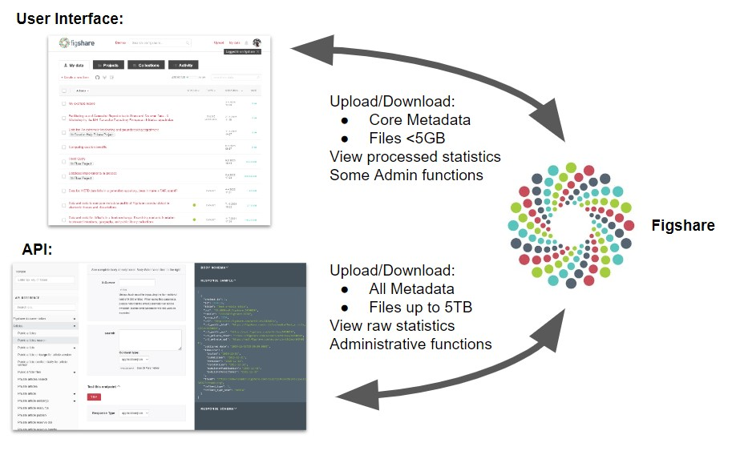

# API Basics

## Resources
- The [Figshare API Documentation](https://docs.figshare.com) provides information on all of the API endpoints. The [resource section](../resources/resources.html) of this site describes how to use the documentation site and provides examples.
- The [Figshare help site](https://help.figshare.com) offers additional information, including [how to get an API token](https://help.figshare.com/article/how-to-get-a-personal-token).

## The Figshare API

The Figshare API provides programmatic access to the repository system and the metadata and files it holds. It provides a way to access information or complete tasks without using the user interface. Figshare has had an API since before 2015 to make sure users have the flexibility they need in integration, uploading, and downloading. 

Working with the API requires using JSON formatted inputs and outputs.

For a simplified version of Figshare fields, you can use [this help page](https://help.figshare.com/article/figshare-metadata-schema-overview).

