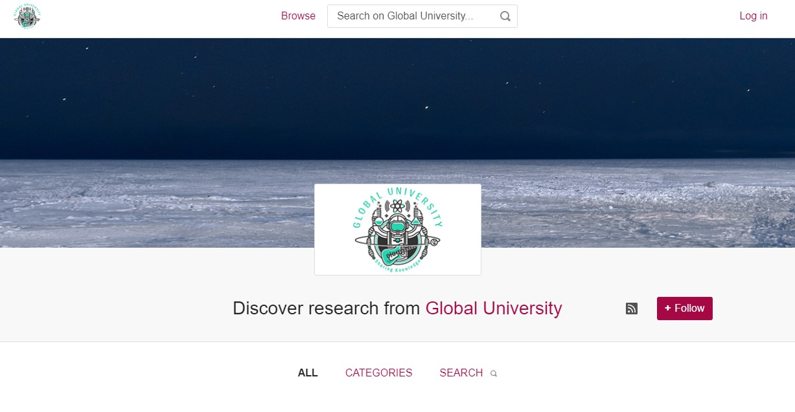

# Introductions and Technology Check

## Introductions
### Instructors
### Group Introductions
- What brought you to this workshop?
- What would you like to get out of the workshop?
- What is your experience with coding and APIs?
 
## Workshop Overview

Because participants may have different skill levels, we want you to go through this workshop with a specific use case that you'd like to apply your knowledge to.  Write down one or two ways you would like to use the Figshare API. Here are some starter ideas:
- Download metadata from my account or my repository for reporting or analysis purposes
- Upload harvested metadata in batch
- Download metadata and associated reuse metrics for reporting purposes
- Upload metadata and files through the API as part of an automated process
- Build the initial components to complete a custom web interface.

## Technology Check

### Software

The Figshare API can be used with any scripting language that can interact with APIs. The [documentation site](https://docs.figshare.com) offers sample code for several different languages. To use those examples you must use the Swagger client.

The examples in this workshop primarily use [Postman](https://www.postman.com/) or [Jupyter Notebook](https://jupyter.org/) with Python. Example scripts using other languages are available from the [API documentation page](htttps://docs.figshare.com). 

**Postman**
To use Postman, you will need to download it to your computer. Postman will create properly formatted API calls for you and can be used to chain API calls.

**Jupyter Notebook and Python**
Jupyter Notebook with Python provides the possibility of creating custom scripts that accomplish multiple tasks all at once. There are two ways to use the example Python scripts:
1. Have Jupyter Notebook and Python downloaded to your computer.
2. Have a Google account and use Google Colab. (some scripts may not be set up for this without additional work)

### Sandbox Instance
If you are at an institution that uses Figshare, it may be beneficial to use your institution's sandbox. If that is not available or your institution does not use Figshare, we will provide access to our Global University sandbox. You can also use a free Figshare account for many of the examples.

